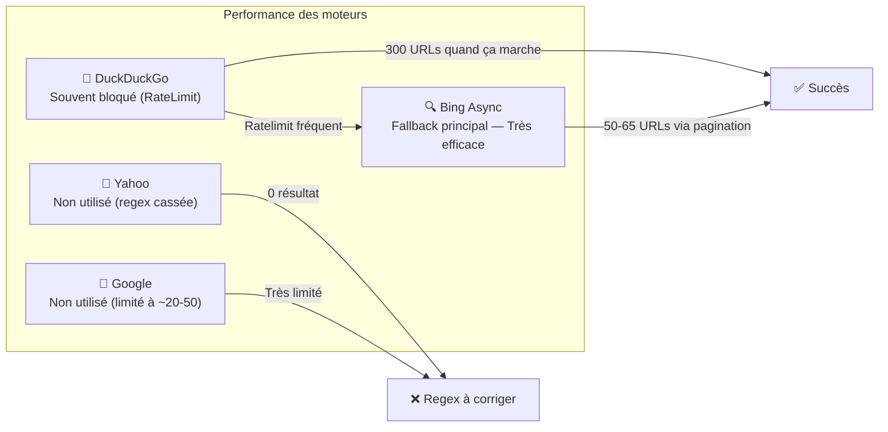
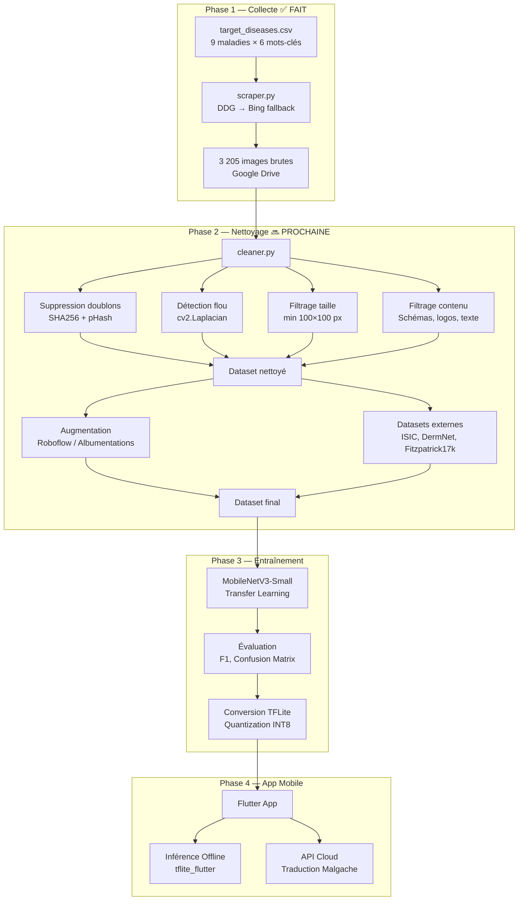

# 🧠 CutisAI — Document d'Architecture et de Réflexion Stratégique

> **Projet** : IA de détection des maladies cutanées tropicales africaines  
> **Cadre** : Master 2 OCC 2026 — Smart Data-City  
> **Auteur** : Franck  
> **Date** : 16 Mars 2026  
> **Version** : 2.0 — Post-collecte d'images

---

## 1. Vision du Projet

### 1.1 Problème adressé

En Afrique tropicale et à Madagascar, la pénurie de dermatologues est critique. Les médecins généralistes en zone rurale doivent diagnostiquer des maladies cutanées complexes **sans formation spécialisée** et **sans accès à un dermatologiste**. Un diagnostic erroné retarde le traitement et aggrave le pronostic.

### 1.2 Solution proposée

**CutisAI** est une **application mobile hors-ligne** destinée aux médecins qui :

1. **Prend une photo** de la peau du patient via la caméra du téléphone
2. **Analyse l'image localement** (sans connexion internet) grâce à un modèle d'IA embarqué
3. **Propose un diagnostic probable** avec un score de confiance
4. **Fournit des recommandations** et, si connecté, traduit en **Malgache** via une API Cloud

### 1.3 Différenciation clé

| Aspect | CutisAI | Solutions existantes |
|--------|---------|---------------------|
| **Connectivité** | Fonctionne 100% offline (TFLite) | Nécessitent internet |
| **Phototypes** | Entraîné sur peaux foncées africaines | Biais vers peaux claires |
| **Maladies** | Tropicales africaines (NTDs) | Dermatologie générale |
| **Langue** | Support Malgache | Anglais/Français uniquement |
| **Taille modèle** | < 10 MB (MobileNetV3) | > 100 MB |

---

## 2. Maladies cibles (9 classes)

| # | Nom FR | Nom EN | Agent pathogène | Type |
|---|--------|--------|-----------------|------|
| 1 | Ulcère de Buruli | Buruli Ulcer | *Mycobacterium ulcerans* | NTD bactérienne |
| 2 | Lèpre | Leprosy | *Mycobacterium leprae* | NTD bactérienne |
| 3 | Leishmaniose cutanée | Cutaneous Leishmaniasis | *Leishmania spp.* | NTD parasitaire |
| 4 | Pian | Yaws | *Treponema pallidum pertenue* | NTD bactérienne |
| 5 | Gale | Scabies | *Sarcoptes scabiei* | NTD parasitaire |
| 6 | Teigne | Ringworm | *Dermatophytosis / Tinea* | Fongique |
| 7 | Tungose | Tungiasis | *Tunga penetrans* | NTD parasitaire |
| 8 | Eczéma | Atopic Dermatitis | *Dermatitis* | Inflammatoire |
| 9 | Mpox | Monkeypox | *Monkeypox virus* | Virale |

> [!NOTE]
> 7 des 9 maladies sont des **Maladies Tropicales Négligées (NTDs)** de l'OMS. L'Eczéma et le Ringworm sont ajoutés car extrêmement fréquents et souvent confondus avec les NTDs.

---

## 3. Bilan Phase 1 — Collecte d'Images ✅ TERMINÉE

### 3.1 Résultats du Scraping (Google Colab, 16 Mars 2026)

Le scraper multi-moteur (`scraper.py`) a été exécuté avec succès sur Google Colab.

**🎯 Total : 3 205 images téléchargées avec succès**

| Maladie | Images collectées | Mots-clés utilisés | Observations |
|---------|:-----------------:|:-------------------:|-------------|
| **Buruli Ulcer** | ~385 | 6 | Bon rendement, surtout via Bing fallback |
| **Leprosy** | ~627 | 6 | Excellent rendement, large corpus disponible |
| **Cutaneous Leishmaniasis** | ~52 | 5 | ⚠️ Faible — beaucoup de doublons détectés |
| **Yaws** | ~215 | 5 | Correct, images "framboesia" très pertinentes |
| **Scabies** | ~144 | 6 | Moyen — termes malgaches donnent 0 résultat |
| **Ringworm** | ~202 | 6 | Bon, tinea capitis bien représenté |
| **Tungiasis** | ~655 | 6 | Excellent rendement |
| **Atopic Dermatitis** | ~482 | 6 | Excellent rendement |
| **Mpox / Monkeypox** | ~443 | 6 | Bon, facilité par l'actualité récente |

### 3.2 Analyse des moteurs de recherche



**Constats :**
- **DuckDuckGo** : Bloqué dans ~70% des cas par rate limiting, mais quand il fonctionne, retourne jusqu'à 300 URLs
- **Bing Async** : Le héros silencieux — fallback fiable avec 50-65 URLs par requête
- **Yahoo/Google** : Inutilisés en pratique, regex à corriger

### 3.3 Problèmes identifiés

| Problème | Sévérité | Impact |
|----------|:--------:|--------|
| **Déséquilibre des classes** : Leishmaniasis (52) vs Tungiasis (655) | 🔴 Critique | Le modèle sera biaisé vers les classes avec plus d'images |
| **Qualité inconnue** : % d'images médicalement pertinentes ? | 🔴 Critique | Des images non pertinentes polluent l'entraînement |
| **Doublons inter-moteurs** : Même image via DDG et Bing | 🟠 Important | Surestimation du volume réel unique |
| **Biais de phototype** : Sources web = majorité peaux claires | 🟠 Important | Contredit l'objectif "peaux foncées africaines" |
| **Termes malgaches** : 0 résultat pour "lagaly", "habokana" | 🟡 Moyen | Perte de diversité culturelle dans le dataset |

---

## 4. Architecture technique

### 4.1 Pipeline complet



### 4.2 Stack technologique

| Couche | Technologie | Justification |
|--------|------------|---------------|
| **Scraping** | Python, DDG, Bing scraping, requests | Multi-moteur, rapide |
| **Nettoyage** | OpenCV, imagehash, Pillow | Standard industriel |
| **Augmentation** | Albumentations ou Roboflow | Augmentations médicales spécialisées |
| **Entraînement** | TensorFlow/Keras sur Google Colab | TFLite natif, GPU gratuit |
| **Modèle** | MobileNetV3-Small | < 5 MB, optimisé mobile |
| **App Mobile** | Flutter + tflite_flutter | Cross-platform, inférence locale |
| **API Cloud** | Gemini API / Claude API | Traduction contextuelle en Malgache |

### 4.3 Structure cible du repository

```
CutisAI/
├── README.md                      # README principal
├── README_COLAB.md                # Guide Colab (✅ fait)
├── target_diseases.csv            # CSV maladies (✅ fait)
├── requirements.txt               # Dépendances Python
│
├── docs/
│   ├── ARCHITECTURE_CUTISAI.md    # Ce document
│   ├── PLAN_IMPLEMENTATION.md     # Plan détaillé par phase
│   └── RAPPORT_SCRAPING.md        # Résultats du scraping
│
├── scraping/
│   ├── scraper.py                 # Scraper v2 (refactorisé)
│   ├── engines/
│   │   ├── __init__.py
│   │   ├── duckduckgo.py
│   │   ├── bing.py
│   │   ├── yahoo.py
│   │   └── google.py
│   └── utils.py                   # Validation, download, hashing
│
├── cleaning/
│   ├── cleaner.py                 # Pipeline de nettoyage
│   ├── deduplicator.py            # Hash SHA256 + pHash
│   └── quality_check.py           # Flou, taille, contenu
│
├── training/
│   ├── train.py                   # Script d'entraînement
│   ├── evaluate.py                # Évaluation + métriques
│   ├── convert_tflite.py          # Conversion TFLite
│   └── notebooks/
│       └── training_colab.ipynb   # Notebook Colab
│
├── mobile_app/
│   └── cutis_ai/                  # Projet Flutter
│       └── lib/
│           ├── main.dart
│           ├── screens/
│           │   ├── home_screen.dart
│           │   ├── camera_screen.dart
│           │   ├── result_screen.dart
│           │   └── info_screen.dart
│           ├── services/
│           │   ├── tflite_service.dart
│           │   └── translation_service.dart
│           ├── models/
│           │   └── disease.dart
│           └── widgets/
│               ├── camera_preview.dart
│               └── confidence_chart.dart
│
└── tests/
    ├── test_scraper.py
    ├── test_cleaner.py
    └── test_model.py
```

---

## 5. Réflexion stratégique approfondie

### 5.1 Le défi fondamental : qualité vs quantité

> [!IMPORTANT]
> **3 205 images scrapées ≠ 3 205 images utilisables.**
> En imagerie médicale, la qualité prime sur la quantité. Un dataset de 500 images bien annotées battra un dataset de 5 000 images bruitées.

**Estimation réaliste du dataset exploitable :**

| Étape | Perte estimée | Images restantes |
|-------|:-------------:|:----------------:|
| Images brutes collectées | — | ~3 205 |
| Après suppression doublons (inter-mots-clés) | -20% | ~2 564 |
| Après suppression images non médicales | -30% | ~1 795 |
| Après suppression images floues/basse résolution | -10% | ~1 615 |
| **Dataset exploitable estimé** | | **~1 600 images** |
| Après augmentation (x5) | | **~8 000 images** |

### 5.2 Stratégie pour compenser le volume limité

1. **Transfer Learning agressif** : Utiliser un modèle pré-entraîné sur ImageNet et ne fine-tuner que les dernières couches
2. **Data Augmentation spécialisée** : Rotations, variations de luminosité/contraste (simuler conditions photo mobile), bruit gaussien
3. **Datasets complémentaires** :
   - **Fitzpatrick17k** : 16 577 images avec labels de phototype (I à VI)
   - **ISIC Archive** : 70 000+ images de lésions (surtout mélanome, mais transférable)
   - **DermNet NZ** : Images libres de droit de maladies cutanées
   - **WHO Image Database** : Images NTDs spécifiques
4. **Few-shot Learning** : Si certaines classes restent trop petites, envisager des techniques de few-shot (Prototypical Networks)

### 5.3 Gestion du déséquilibre des classes

Le dataset est **très déséquilibré** :

```
Tungiasis        : ████████████████████████████████ 655
Leprosy          : ██████████████████████████████   627
Atopic Derm.     : ████████████████████████         482
Mpox             : ██████████████████████           443
Buruli Ulcer     : ███████████████████              385
Yaws             : ██████████                       215
Ringworm         : ██████████                       202
Scabies          : ███████                          144
Leishmaniasis    : ██                                52
```

**Solutions :**
- **Oversampling** (SMOTE adapté images) des classes minoritaires
- **Class weights** dans la loss function (pondération inversement proportionnelle à la fréquence)
- **Augmentation ciblée** : Plus d'augmentations pour Leishmaniasis et Scabies
- **Collecte supplémentaire ciblée** : Re-run du scraper avec de nouveaux mots-clés pour les classes faibles

### 5.4 Considérations éthiques et réglementaires

> [!CAUTION]
> **Attention critique** : Ce projet utilise des images médicales scrapées du web.
> - Les images peuvent être protégées par le droit d'auteur
> - L'utilisation à des fins de recherche/éducation bénéficie généralement d'exceptions (fair use)
> - Pour un déploiement commercial : obtenir des datasets sous licence explicite
> - L'IA ne remplace PAS le diagnostic médical — elle assiste le médecin

### 5.5 Contraintes techniques pour l'inférence mobile

| Contrainte | Limite | Solution |
|-----------|--------|----------|
| Taille du modèle | < 10 MB | MobileNetV3-Small + quantization INT8 |
| Résolution d'entrée | 224×224 px | Pré-traitement côté app |
| Latence inférence | < 500 ms | TFLite GPU Delegate |
| RAM mobile | < 200 MB | Batch size = 1 |
| Pas d'internet | Offline obligatoire | Modèle embarqué dans l'APK |

---

## 6. Risques et mitigations

| Risque | Probabilité | Impact | Mitigation |
|--------|:-----------:|:------:|-----------|
| Dataset trop petit pour 9 classes | 🟠 Élevée | 🔴 Critique | Datasets complémentaires + augmentation |
| Biais vers peaux claires | 🟠 Élevée | 🔴 Critique | Fitzpatrick17k + mots-clés ciblés "dark skin" |
| Confusion inter-classes (Leprosy ↔ Leishmaniasis) | 🟠 Élevée | 🟠 Important | Matrice de confusion + annotation experte |
| Scraping bloqué (rate limiting) | 🟡 Modérée | 🟡 Moyen | ✅ Résolu — Bing fallback fonctionne |
| Google Colab timeout pendant l'entraînement | 🟡 Modérée | 🟡 Moyen | Checkpoints + reprise automatique |
| Modèle trop gros pour mobile | 🟢 Faible | 🟠 Important | MobileNetV3-Small + INT8 quantization |

---

## 7. Métriques de succès

| Métrique | Objectif minimum | Objectif idéal |
|----------|:----------------:|:--------------:|
| Accuracy globale | > 70% | > 85% |
| F1-score moyen (macro) | > 65% | > 80% |
| F1-score par classe (min) | > 50% | > 70% |
| Taille modèle TFLite | < 15 MB | < 5 MB |
| Latence inférence (mobile) | < 1 000 ms | < 300 ms |
| Sensibilité (recall) NTDs | > 75% | > 90% |

> [!TIP]
> La **sensibilité (recall)** est plus importante que la précision pour un outil de screening médical : il vaut mieux un faux positif (le médecin vérifie) qu'un faux négatif (maladie non détectée).

---

*Document vivant — à mettre à jour à chaque phase du projet.*
